## Criando um Pull Request

Sempre que é necessário realizar alguma atualização de conteúdo nos repositórios `trybe`, `course` ou `live-lectures`, devemos abrir um **Pull Request**. Para isto, seguimos algumas regras que têm como objetivo manter os repositórios da Trybe com um padrão claro de organização.

### Observações importantes:
Sempre que um pull request é aberto no repositório `course`, um novo pull request é aberto automaticamente no repositório `trybe`. Isto acontece pois o repositório `trybe` é o local que recebe o conteúdo a ser renderizado no [app.betrybe.com](https://app.betrybe.com/).
Desta forma, para evitar que novos conteúdos sejam disponibilizados com erro para as pessoas estudantes, é necessário que:
- Seja realizado **Code Review** nos pull requests abertos nos repositórios `course` e `trybe`.
- Para realizar um `merge`, os pull requests devem ter no **mínimo** duas aprovações. É **obrigatório** que pelo menos uma das aprovações seja de uma pessoa especialista.
- É uma boa prática "linkar" o pull request do repositório da automação (`trybe`) na descrição do pull request do repositório `course`.

### Antes de abrir um Pull Request:
  1. Clonar o repositório que será utilizado.
  2. Atualizar o repositório com as últimas alterações utilizando o comando `git pull`.
  3. Criar uma `branch` de trabalho a partir da `master`.
  4. Realizar alterações.
  5. Adicionar as alterações através do comando `git add`.
  6. Realizar o `commit` das alterações através do comando `git commit`.
  7. Subir as alterações utilizando o comando `git push`.

### Abrindo o Pull Request:
- Abrindo o pull request:

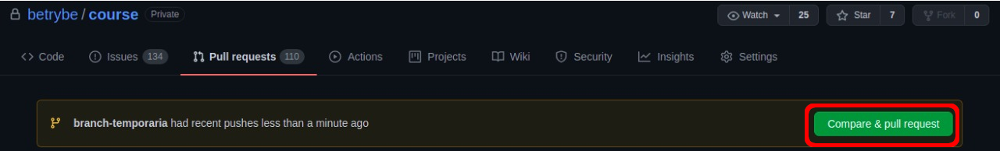

- Verifique se a branch `master` do repositório está sendo "comparada" com a sua branch.

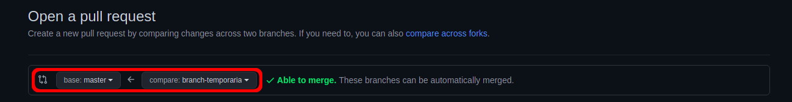

- Adicione um título ao seu pull request.
  - Siga o seguinte padrão: [TIPO DE TAREFA] NºBLOCO.NºDIA - BREVE DESCRIÇÃO DA TAREFA.

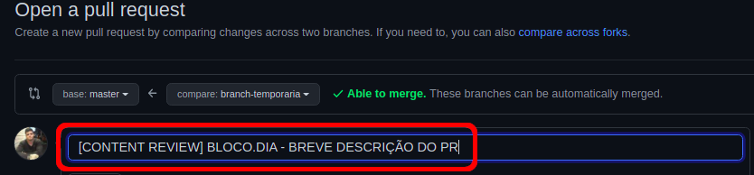

- Adicione um texto explicativo sobre o que será modificado. Além disso, caso existam referências externas, adicione o link junto a descrição.

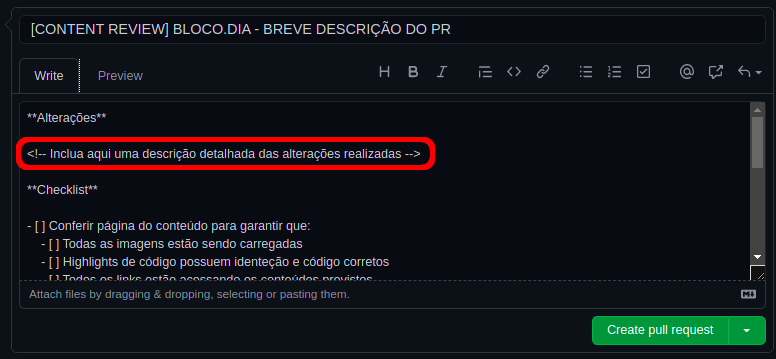

- Os itens da lista de tarefas ("checklist") gerado pelo template de abertura de pull requests, **devem** ser percorridos e verificados para que seu pull request possa ser revisado. Caso algum item não se aplique à modificação que está sendo implementada, adicione uma observação.

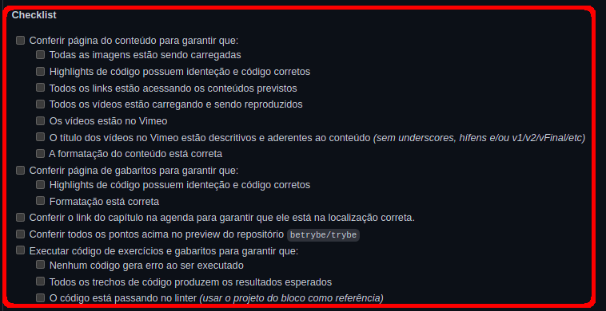

- Faça o link entre o seu pull request e a_issue_ aberta para a tarefa seguindo o seguinte padrão: "CLOSES #NÚMERO_DA_ISSUE"

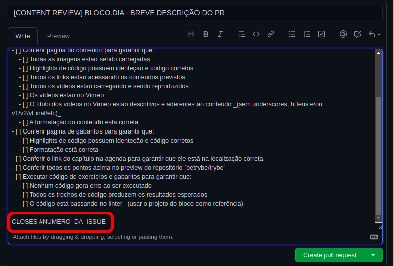

- Adicione a pessoa resposável ou as pessoas responsáveis (_"Assignees"_) pela terefa.
  - A pessoa resposnsável pode ser somente você, ou pode ser também, a equipe que compõe a "sprint".

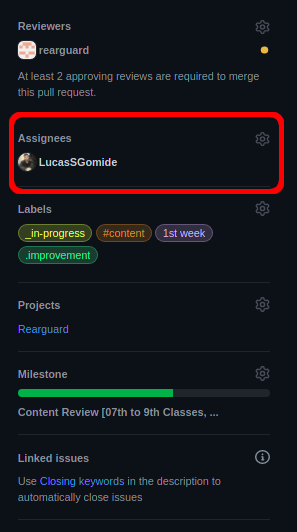

- Adicione _Labels_ referentes à tarefa. Por padrão adicionamos:
  - Semana em que estamos trabalhando. Ex: 1st week.
  - Situação da tarefa. Ex: _in-progress, _code-review ou Finalizado.
  - .improvement e content.

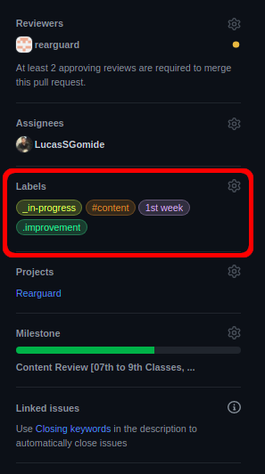

- Selecione o tipo de projeto ("_Projects_") que está sendo executado.
  - Para este exemplo **Rearguard**.

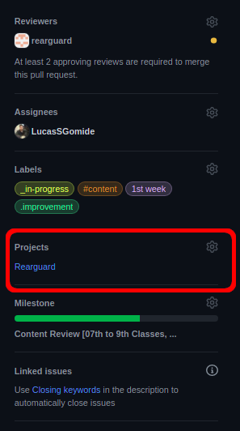

- Faça o link entre o seu pull request e a _Milestone_ da sua "sprint".
  - Se necessário, filtre pelo nome da sua "sprint".

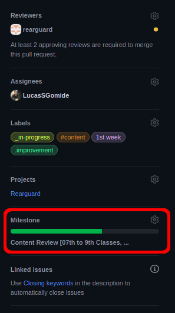

Crie seu pull request como _draft pull request_.

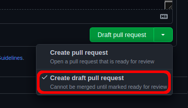

### Após finalizar as alterações:

- Quando todas as modificações estiverem completas e seu trabalho estiver pronto para revisão ("_Code Review_"), faça as seguintes alterações:
    - Modifique o tipo do seu **_draft pull request_** para **_create pull request_**.
    - Modifique a _Label_ **_in-progress** para **_code-review**.

- Adicione um link entre o Pull Request da automação (Repositório `trybe`) e o seu Pull Request.
  - Você pode encontrar o pull request da automação em [github.com/betrybe/trybe/pulls](https://github.com/betrybe/trybe/pulls) 
  - Utilize o número do seu pull request criado no repositório `course` para encontrar o pull request gerado pela automação no repositório `trybe`.

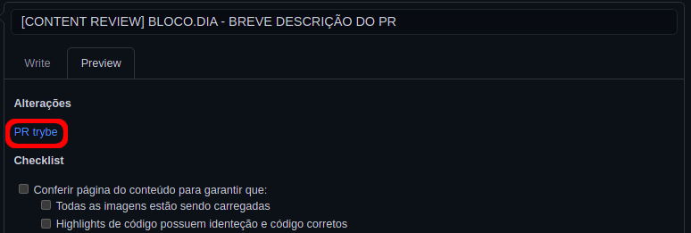

- Ao final o corpo do seu pull request deve ser semelhante ao da imagem abaixo:

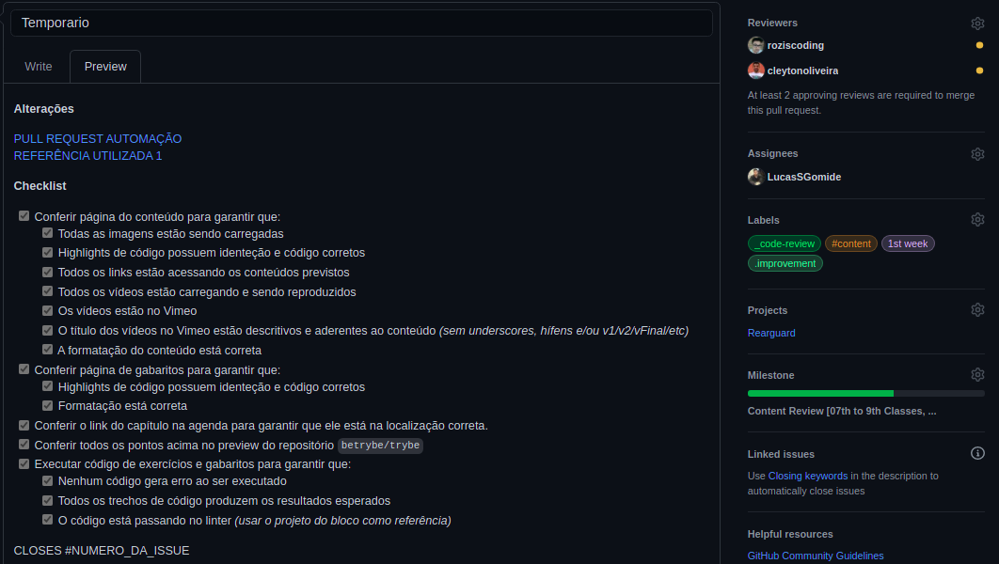

- Quando seu pull request tiver duas aprovações nos repositórios `course` e `trybe`, o `merge` da `branch` poderá ser realizado.
